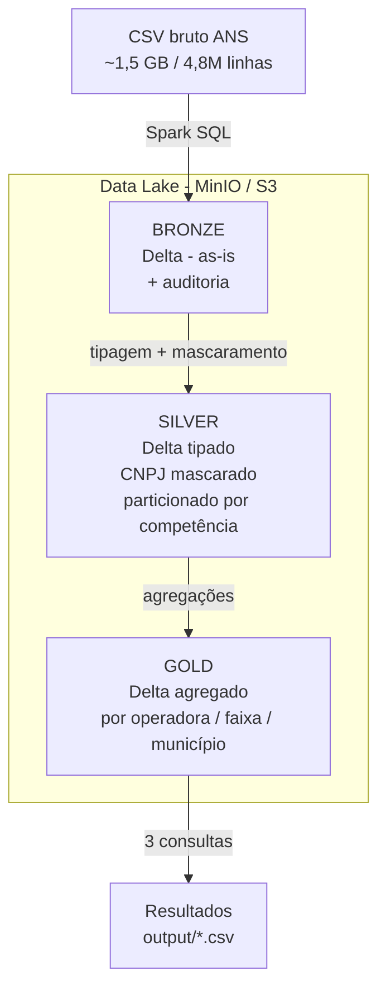
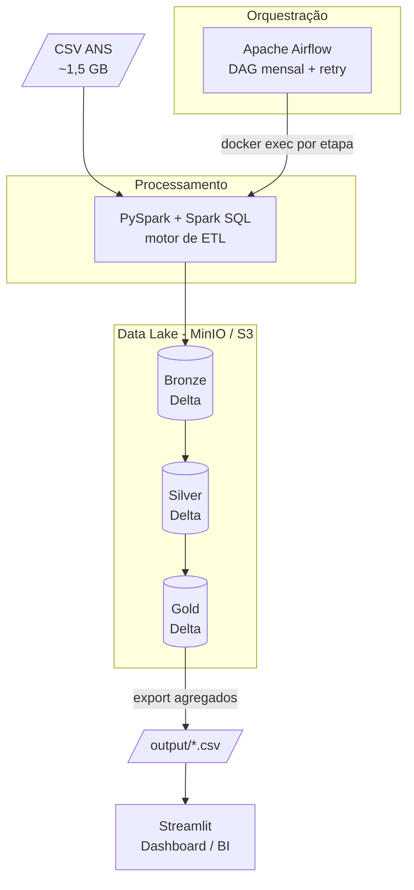

# Case Engenheiro de Dados — Pipeline Medallion (ANS Beneficiários SP)

Pipeline de dados em **arquitetura Medallion** (Bronze → Silver → Gold) sobre os dados
públicos da **ANS** (operadoras e beneficiários de planos de saúde de São Paulo).

O projeto emula, **localmente via Docker**, a mesma stack usada em produção na nuvem
(AWS / Databricks) — sem qualquer custo de nuvem e 100% reproduzível:

| Papel no pipeline            | Tecnologia local (este projeto) | Equivalente em produção                    |
|------------------------------|---------------------------------|--------------------------------------------|
| Orquestração                 | **Apache Airflow**              | Airflow / MWAA / Databricks Workflows      |
| Processamento / ETL          | **PySpark**                     | AWS Glue / Databricks / Spark              |
| Formato do data lake         | **Delta Lake**                  | Delta Lake (Databricks)                    |
| Object storage (data lake)   | **MinIO** (S3-compatible)       | Amazon S3                                  |
| Consulta SQL analítica       | **Spark SQL**                   | Amazon Athena / Databricks SQL             |
| Camada curada (warehouse)    | **Gold (Delta)**                | Amazon Redshift                            |
| Visualização / BI            | **Streamlit**                   | Amazon QuickSight / Power BI / Databricks  |

O mesmo código Spark/Delta e os mesmos scripts SQL rodam sem alteração no
**Databricks** (basta apontar os caminhos para o S3 real).

---

## Arquitetura

O diagrama abaixo mostra o **fluxo dos dados** pelas camadas Medallion:



### Arquitetura técnica (componentes)

O diagrama acima mostra o **fluxo dos dados** (camadas Medallion). Este mostra **como
o pipeline roda de fato** — a stack que emula, localmente, o ambiente de produção na
nuvem (ver tabela de equivalências no topo):



- O **Airflow** apenas orquestra: cada task dispara uma etapa no container Spark via
  `docker exec` — **sem duplicar** a lógica, que continua nos scripts SQL.
- O **Spark** lê o CSV bruto e grava as camadas em **Delta** no **MinIO** (S3-compatible).
- O **Streamlit** é desacoplado do Spark: consome só os agregados da Gold
  (`output/*.csv`), sem reprocessar os 4,8M de registros.

### Camadas

- **Bronze** (`sql/00_bronze.sql`) — ingestão do CSV *as-is*, todas as colunas como
  texto, apenas com metadados de auditoria (`_ingested_at`, `_source_file`). Formato Delta.
- **Silver** (`sql/01_silver.sql`) — tipagem correta (quantidades → `INT`, `DT_CARGA` →
  `DATE`), normalização de nomes para `snake_case`, **mascaramento do CNPJ** (mantém a
  raiz de 8 dígitos e oculta o restante) e **particionamento por competência**
  (`id_cmpt_movel`), padrão para cargas mensais.
- **Gold** (`sql/02_gold.sql`) — tabelas agregadas, uma por pergunta do case, para
  consumo analítico rápido sem reprocessar os 4,8M de registros.

---

## Dados (como obter)

O arquivo bruto **não é versionado** no Git (≈ **1,5 GB**, `4.830.707` registros) —
por isso, após clonar o repositório, é preciso baixá-lo separadamente.

**⬇️ Download direto (clique):**
<https://ftp.dadosabertos.ans.gov.br/FTP/PDA/informacoes_consolidadas_de_beneficiarios-024/202508/pda-024-icb-SP-2025_08.zip>

Depois de baixar, **descompacte o `.zip`** e coloque o `.csv` em `data/`:

```
data/pda-024-icb-SP-2025_08.csv
```

- **Fonte oficial:** Dados Abertos da ANS — <https://dadosabertos.ans.gov.br/>
  (seção de *Informações Consolidadas de Beneficiários*).
- **Arquivo esperado:** `pda-024-icb-SP-2025_08.csv` — beneficiários de São Paulo,
  competência **2025-08**. UTF-8, separador `;`, campos entre aspas.
- **Nome exato importa:** o ambiente valida esse arquivo na subida (serviço
  `preflight`); se ele faltar, o `docker compose up` **aborta com mensagem clara**
  em vez de falhar no meio do processamento.

> Para reproduzir com outra competência/UF, basta ajustar o caminho em
> `.env` / `src/config.py` (placeholder `{{CSV_PATH}}`) — o SQL não muda.

---

## Como executar

Pré-requisitos: **Docker** e **Docker Compose**.

**Passo 1 — baixe a base** e coloque em `data/` (só isso é manual):

**⬇️ [pda-024-icb-SP-2025_08.zip](https://ftp.dadosabertos.ans.gov.br/FTP/PDA/informacoes_consolidadas_de_beneficiarios-024/202508/pda-024-icb-SP-2025_08.zip)** →
descompacte → `data/pda-024-icb-SP-2025_08.csv`
(detalhes em **[Dados (como obter)](#dados-como-obter)**).

**Passo 2 — suba tudo com um comando:**

```bash
# (opcional) copie o exemplo de variáveis de ambiente
cp .env.example .env

# Um comando faz tudo, em ordem: valida a base -> build -> roda o pipeline
# (Bronze -> Silver -> Gold -> Consultas) -> e só então sobe o dashboard.
docker compose up -d --build
```

> **Como funciona a ordem:** o `up` primeiro valida que a base está em `data/`
> (serviço `preflight` — se faltar, **aborta aqui** com mensagem clara). Em
> seguida roda o pipeline num container one-shot (`pipeline`) e, quando ele
> termina, sobe o **Streamlit já com os dados** — sem estado vazio e sem precisar
> reiniciar nada. Na **primeira** vez o pipeline processa os 4,8M de registros, então
> o `up` **fica bloqueado alguns minutos** até concluir. Para acompanhar, em outro
> terminal:
>
> ```bash
> docker compose logs -f pipeline
> ```
>
> **Roda só se necessário:** se os 5 CSVs da Gold já existem em `output/`, o
> `pipeline` **pula o reprocessamento** — do 2º `up` em diante o ambiente sobe em
> segundos. Para **forçar** um reprocesso, apague `output/*.csv` ou rode o comando
> manual (veja abaixo).

Pronto. Acesse:

- **Dashboard (Streamlit)** — respostas do case + insights: http://localhost:8501
- **JupyterLab** (notebooks estilo Databricks): http://localhost:8888
- **Console do MinIO** (ver os buckets bronze/silver/gold): http://localhost:9001
  (usuário/senha: `minioadmin` / `minioadmin`)
- **Spark UI** (durante um job): http://localhost:4040
- **Spark History Server** (Spark UI de execuções já finalizadas): http://localhost:18080

**Reprocessar** sem re-subir o ambiente (o container `case-spark` fica vivo) — o
pipeline é idempotente (full-refresh), então rodar de novo é seguro:

```bash
# pipeline completo
docker compose exec spark python -m src.run_pipeline

# ou apenas uma etapa
docker compose exec spark python -m src.run_pipeline silver
```

Os resultados das 3 consultas são exibidos no console e salvos em `output/`.

---

## Orquestração (Apache Airflow)

Além de rodar o pipeline pela linha de comando, o projeto inclui um **DAG do
Airflow** que orquestra as etapas de forma programática, com dependências,
agendamento mensal (`@monthly`, acompanhando a atualização dos dados da ANS),
retry e interface visual.

A lógica **não é duplicada**: cada task do DAG apenas dispara a etapa
correspondente no container Spark via `docker exec` — a transformação continua
nos scripts SQL. Cada etapa é um processo isolado (como um *job task* no
Databricks Workflows / AWS Glue), e o catálogo é compartilhado entre elas por
um **metastore Hive persistente**.

```
bronze  ->  silver  ->  gold  ->  consultas
```

Acesso à UI: **http://localhost:8080**

- Usuário: `admin`
- Senha: `admin`

Na UI, habilite (toggle) o DAG `pipeline_medallion_ans` e clique em **Trigger**.
Também dá para rodar tudo pela linha de comando, sem a UI:

```bash
# executa o DAG inteiro de forma síncrona (roda no processo do scheduler)
docker compose exec airflow-scheduler airflow dags test pipeline_medallion_ans 2025-08-01
```

## Consultas do case

As três respostas estão em `sql/03_consultas.sql` e são executadas por
`src/queries.py`:

- **(a)** As 5 operadoras com maior número de beneficiários ativos.
- **(b)** A faixa etária com mais beneficiários (e o total).
- **(c)** Quantidade de beneficiários por município, em ordem decrescente.

Saídas geradas:

| Arquivo                                    | Conteúdo                                  |
|--------------------------------------------|-------------------------------------------|
| `output/a_top5_operadoras.csv`             | (a) 5 maiores operadoras                  |
| `output/b_faixa_etaria_top.csv`            | (b) faixa etária líder                    |
| `output/c_beneficiarios_por_municipio.csv` | (c) municípios (decrescente)              |
| `output/insight_operadoras.csv`            | ranking completo de operadoras (insights) |
| `output/insight_faixa_etaria.csv`          | distribuição completa por faixa (insights)|

### Resultados (competência 2025-08)

Processados **4.830.707 registros** do arquivo da ANS.

**(a) As 5 operadoras com maior número de beneficiários ativos**

| # | Código | Operadora                                  | Beneficiários ativos |
|---|--------|--------------------------------------------|---------------------:|
| 1 | 359017 | NOTRE DAME INTERMÉDICA SAÚDE S.A.          |            4.324.507 |
| 2 | 301949 | ODONTOPREV S/A                             |            2.844.728 |
| 3 | 326305 | AMIL ASSISTÊNCIA MÉDICA INTERNACIONAL S.A. |            2.671.950 |
| 4 | 006246 | SUL AMERICA COMPANHIA DE SEGURO SAÚDE      |            2.111.707 |
| 5 | 000582 | PORTO SEGURO - SEGURO SAÚDE S/A            |            1.391.580 |

**(b) Faixa etária com mais beneficiários**

A faixa **40 a 44 anos**, com **3.100.823** beneficiários ativos.

**(c) Beneficiários por município (decrescente)**

646 municípios no total. Top 10:

| # | Código | Município             | Beneficiários ativos |
|---|--------|-----------------------|---------------------:|
| 1 | 355030 | São Paulo             |            9.833.635 |
| 2 | 350950 | Campinas              |            1.031.975 |
| 3 | 351880 | Guarulhos             |            1.013.731 |
| 4 | 354870 | São Bernardo do Campo |              747.368 |
| 5 | 354780 | Santo André           |              703.818 |
| 6 | 353440 | Osasco                |              603.048 |
| 7 | 355220 | Sorocaba              |              596.055 |
| 8 | 354990 | São José dos Campos   |              581.614 |
| 9 | 354340 | Ribeirão Preto        |              563.972 |
|10 | 352590 | Jundiaí               |              444.951 |

Lista completa em `output/c_beneficiarios_por_municipio.csv`.

---

## Validação / qualidade de dados

O notebook `notebooks/validacao_dados.ipynb` faz a **validação e reconciliação**
dos dados de forma independente do pipeline: ele *não confia* na Gold — recalcula
as respostas direto da Silver e reconcilia contra (1) as tabelas Gold, (2) os
entregáveis em `output/*.csv` e (3) os valores de referência do case. São 8
baterias de checagem, cada uma registrando um `PASS`/`FAIL` e um `assert` final
que falha o notebook se algo quebrar:

| # | Verificação                                                         |
|---|---------------------------------------------------------------------|
| V1 | Integridade de volume (CSV = Bronze = Silver, 1:1)                  |
| V2 | Tipagem sem perda (o `CAST ... AS INT` não gerou nulos a mais)      |
| V3 | Mascaramento/LGPD (100% dos CNPJ mascarados, raiz de 8 no máximo)   |
| V4 | Sanidade de valores (sem quantidade de ativos negativa)            |
| V5 | Gold == recomputo independente da Silver (zero divergências)       |
| V6 | Entregáveis (`output/*.csv`) == Gold                               |
| V7 | Consistência cruzada (soma total idêntica na Silver e nas 3 Golds) |
| V8 | Conferência contra os valores de referência da competência 2025-08 |

Rode-o no JupyterLab (http://localhost:8888) **depois** de executar o pipeline —
ele lê os dados Delta das camadas direto do MinIO e os CSVs de `output/`.

---

## Dashboard (Streamlit)

Uma camada de **visualização/BI** (equivalente a *QuickSight / Power BI /
Databricks Dashboards*) consome a camada **Gold** curada — os CSVs de `output/` —
e apresenta as 3 respostas do case junto com alguns **insights** extras.

Sobe **automaticamente após o pipeline** (serviço `streamlit` do `docker-compose`,
que depende da conclusão do job `pipeline`): quando o dashboard aparece, já está
com os dados — **não precisa reiniciar**. Se quiser subir só ele explicitamente:

```bash
docker compose up -d --build streamlit
```

Acesso: **http://localhost:8501**

O dashboard traz:

- **KPIs**: total de beneficiários ativos, nº de operadoras, nº de municípios e
  faixa etária líder.
- **(a)** Ranking das operadoras + **concentração de mercado** (share do líder e
  das 5 maiores).
- **(b)** Distribuição completa por **faixa etária** (perfil demográfico), com a
  faixa líder em destaque.
- **(c)** Top municípios + tabela pesquisável dos 646 + **concentração
  geográfica** (peso da capital e do top 10).

> O dashboard lê apenas agregados já prontos (não reprocessa os 4,8M de
> registros). Os `insight_*.csv` são **parte do pipeline** — consultas de
> `sql/03_consultas.sql` executadas por `src/queries.py` e **regeneradas a cada
> execução**, não artefatos manuais. São eles que alimentam os gráficos
> completos: o Top-10 de operadoras e a **pirâmide etária das 17 faixas**. O
> fallback para as respostas reduzidas do case (top5 / top1) existe só como
> **rede de segurança**, caso os arquivos faltem — não é o estado normal.

---

## Estrutura do projeto

```
.
├── docker-compose.yml      # MinIO (S3) + Spark/Jupyter + Airflow
├── Dockerfile              # imagem Spark + Delta + jars S3A
├── requirements.txt
├── data/                   # CSV bruto da ANS (não versionado)
├── sql/                    # lógica das camadas em Spark SQL
│   ├── 00_bronze.sql
│   ├── 01_silver.sql
│   ├── 02_gold.sql
│   └── 03_consultas.sql
├── src/                    # execução em Python
│   ├── config.py           # SparkSession (Delta + S3A/MinIO + metastore Hive)
│   ├── sql_runner.py       # executa os arquivos .sql
│   ├── queries.py          # roda e salva as 3 consultas
│   └── run_pipeline.py     # runner Bronze->Silver->Gold->Consultas
├── airflow/                # orquestração
│   ├── Dockerfile          # Airflow + CLI do Docker
│   └── dags/
│       └── pipeline_medallion_dag.py
├── app/                    # dashboard Streamlit (camada de BI)
│   ├── Dockerfile          # imagem enxuta (sem Spark/Java)
│   ├── requirements.txt
│   └── streamlit_app.py
├── notebooks/              # versão notebook (estilo Databricks)
│   ├── pipeline_medallion.ipynb   # pipeline Bronze->Silver->Gold + consultas
│   └── validacao_dados.ipynb      # validação/reconciliação de qualidade de dado
├── docs/                   # apresentação/defesa (APRESENTACAO.md), diagramas
└── output/                 # resultados das consultas (consumidos pelo dashboard)
```

---

## Notas de engenharia

- **Formato Delta** em todas as camadas transacionais (Silver/Gold): tipagem forte,
  versionamento (time travel) e leitura/escrita otimizadas.
- **Mascaramento** aplicado na Silver, cumprindo a regra de dado sensível do case.
- **Particionamento** por competência na Silver e **pré-agregação** na Gold como
  estratégias de performance.
- **Modularidade**: cada camada é um script SQL isolado; o Python só executa.
- **Validação de dados**: notebook de reconciliação (`notebooks/validacao_dados.ipynb`)
  que recalcula as respostas a partir da Silver e confere volume, tipagem,
  mascaramento, agregações da Gold e os valores de referência (8 checagens).
- **Orquestração**: DAG do Airflow com dependências, agendamento e retry,
  reaproveitando as mesmas etapas sem duplicar lógica.
- **Portabilidade**: trocar MinIO por S3 real e Spark local por Databricks exige
  apenas ajustar credenciais/caminhos — o SQL não muda.
