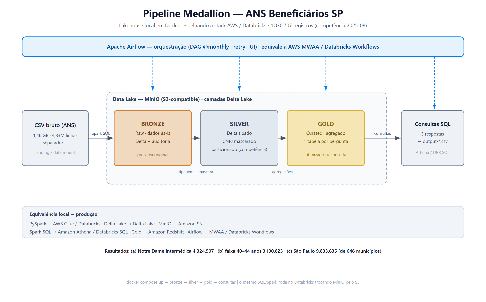

# Case Engenheiro de Dados — Documento de Apresentação

Guia para apresentar e **defender** a solução: o que foi feito, por quê, os
problemas reais que apareceram no caminho e como foram resolvidos, além de um
Q&A com as perguntas mais prováveis.

---

## 1. Contexto e objetivo

O case pede um **pipeline de dados em arquitetura Medallion** (Bronze → Silver →
Gold), em SQL, sobre um arquivo público da ANS com beneficiários de planos de
saúde de São Paulo, respondendo a 3 perguntas de negócio.

- **Volume:** 1,46 GB, **4.830.707 registros** (competência 2025-08).
- **Decisão de fundo:** em vez de fazer o mínimo (um script SQL), montei um
  **lakehouse completo em Docker** que espelha a stack de produção da empresa
  (AWS Glue/Athena/S3/Redshift + Databricks/Spark), rodando 100% local, sem custo
  de nuvem e reproduzível por qualquer avaliador com um `docker compose up`.

## 2. Por que essa stack

| Escolha              | Justificativa                                                                 |
|----------------------|-------------------------------------------------------------------------------|
| **PySpark + Delta**  | É o núcleo do Databricks e do AWS Glue. 1,5 GB justifica processamento distribuído de verdade. |
| **Delta Lake**       | Formato tabular pedido no case; dá tipagem forte, versionamento e transações. |
| **MinIO (S3)**       | Object storage compatível com S3 → o "data lake" fica em buckets, como no S3 real. |
| **Spark SQL**        | Mantém a linguagem SQL pedida no case; é o que o Athena/Databricks SQL executam. |
| **Apache Airflow**   | Orquestração real (DAG, dependências, agendamento, retry, UI), como Databricks Workflows / MWAA. |
| **Docker Compose**   | Amarra tudo, reproduzível, sem depender de conta em nuvem.                     |

Ponto-chave para a defesa: **o mesmo código Spark/Delta e os mesmos scripts SQL
rodam no Databricks** — bastaria trocar credenciais/caminhos do MinIO pelo S3 real.

## 3. Arquitetura



```
CSV (1,5 GB)
   │  Spark SQL
   ▼
┌─────────── Data Lake (MinIO / S3) ───────────┐
│  BRONZE   → Delta, dados as-is + auditoria    │
│  SILVER   → Delta tipado, CNPJ mascarado,     │
│             particionado por competência       │
│  GOLD     → Delta agregado (1 tabela/pergunta) │
└───────────────────────────────────────────────┘
   │  3 consultas
   ▼
output/*.csv     (orquestrado pelo Airflow: bronze→silver→gold→consultas)
```

**Camadas:**

- **Bronze (`sql/00_bronze.sql`):** ingestão *as-is*. Todas as colunas como texto,
  sem transformação, só metadados de auditoria (`_ingested_at`, `_source_file`).
  Princípio: preservar o dado bruto para poder reprocessar.
- **Silver (`sql/01_silver.sql`):** tipagem (quantidades → `INT`, `DT_CARGA` →
  `DATE`), nomes em `snake_case`, **mascaramento do CNPJ** (`CONCAT(SUBSTRING(
  nr_cnpj,1,8),'******')`) e **particionamento por competência** (`id_cmpt_movel`),
  padrão para cargas mensais.
- **Gold (`sql/02_gold.sql`):** três tabelas agregadas, uma por pergunta do case.
  Pré-agregar evita reprocessar 4,8M de linhas a cada consulta (performance).

**Separação de responsabilidades:** a regra de negócio vive em SQL (`sql/`); o
Python (`src/`) só orquestra; o Airflow (`airflow/dags/`) agenda e encadeia.

## 4. Resultados das 3 consultas (competência 2025-08)

**(a) Top 5 operadoras por beneficiários ativos**

| # | Operadora                                  | Ativos     |
|---|--------------------------------------------|-----------:|
| 1 | NOTRE DAME INTERMÉDICA SAÚDE S.A.          | 4.324.507  |
| 2 | ODONTOPREV S/A                             | 2.844.728  |
| 3 | AMIL ASSISTÊNCIA MÉDICA INTERNACIONAL S.A. | 2.671.950  |
| 4 | SUL AMERICA COMPANHIA DE SEGURO SAÚDE      | 2.111.707  |
| 5 | PORTO SEGURO - SEGURO SAÚDE S/A            | 1.391.580  |

**(b) Faixa etária com mais beneficiários:** `40 a 44 anos` — **3.100.823**.

**(c) Beneficiários por município (decrescente):** 646 municípios; líderes:
São Paulo (9.833.635), Campinas (1.031.975), Guarulhos (1.013.731).

---

## 5. Problemas enfrentados e como resolvi

Esta seção é o coração da defesa: mostra depuração real, não um caminho "mágico".

### 5.1. Java indisponível na imagem base
- **Sintoma:** o build do Docker quebrou em `apt-get install openjdk-17-jre-headless`
  — "has no installation candidate".
- **Causa raiz:** a tag `python:3.11-slim` passou a apontar para o Debian **trixie**,
  que removeu o OpenJDK 17 (só oferece o 21). O Spark 3.5 é homologado até o Java 17.
- **Solução:** fixei a base em `python:3.11-slim-bookworm` (Debian 12), que ainda
  tem o JDK 17.
- **Lição:** não confiar em tags "flutuantes"; fixar a distribuição base garante
  reprodutibilidade.

### 5.2. Split de SQL quebrando no separador do CSV
- **Sintoma:** `ParseException` logo na Bronze, com o comando cortado em `sep '`.
- **Causa raiz:** meu executor de `.sql` separava os statements por `;`, mas o
  próprio SQL tem um `;` **dentro de aspas** (`sep ';'`, o separador do CSV). O
  split ingênuo cortava o comando no meio.
- **Solução:** reescrevi o splitter para ser *quote-aware* (ignora `;` dentro de
  strings).
- **Lição:** parsing de SQL "na unha" tem armadilhas; tratar o estado de aspas.

### 5.3. Estouro de memória (OOM) ao escrever a Bronze
- **Sintoma:** `MemoryManager: Total allocation exceeds 95%` e falha na escrita.
- **Causa raiz:** o Spark subiu em modo local com o **heap padrão de 1 GB**, e a
  escrita usava 16 writers Parquet concorrentes, cada um bufferizando um row group.
- **Solução:** `--driver-memory 6g` (via `PYSPARK_SUBMIT_ARGS`, setado **antes** da
  JVM subir) e `master local[4]` (menos writers concorrentes). O Docker tinha 49 GB
  disponíveis; era só o Spark não estar usando.
- **Lição:** em modo local o driver É o executor; a memória default não serve para
  volumes reais. `spark.driver.memory` precisa ser definido antes do boot da JVM.

### 5.4. Airflow não enxergava as tabelas entre etapas (o problema mais sutil)
- **Sintoma:** rodando pelo Airflow, a task `consultas` falhou com
  `TABLE_OR_VIEW_NOT_FOUND: gold.beneficiarios_por_operadora` — mesmo a Gold
  existindo no MinIO. Rodando o pipeline inteiro de uma vez, funcionava.
- **Causa raiz:** a `SparkSession` usava o **catálogo em memória** (sem Hive). Ele
  vive só dentro de um processo. Quando o pipeline roda tudo junto (um processo), o
  catálogo persiste na sessão. Mas **cada task do Airflow é um processo separado**
  (`docker exec`), então uma etapa não via as tabelas criadas pela anterior.
- **Solução:** habilitei **metastore Hive persistente** (Derby em `/app/metastore_db`)
  com `.enableHiveSupport()`. O catálogo passou a persistir em disco e a ser
  compartilhado entre os processos das tasks.
- **Lição:** o que funciona num script monolítico pode quebrar em orquestração
  distribuída. Catálogo persistente é pré-requisito para pipelines multi-job.

### 5.5. Airflow standalone (SQLite) não subia a UI — troquei por setup de produção
- **Sintoma:** no modo `standalone` a UI na porta 8080 nunca entrava em LISTEN;
  ficava respondendo HTTP 000 indefinidamente.
- **Causa raiz:** o `standalone` usa **SQLite + SequentialExecutor**, que não suporta
  a concorrência dos 3 componentes (webserver, scheduler, migração) subindo juntos —
  o webserver não completava o boot.
- **Solução:** migrei para o **setup real de produção**: metadados em **Postgres**,
  serviços **separados** (`airflow-webserver` + `airflow-scheduler`) com
  **LocalExecutor**, e um `airflow-init` one-shot que faz a migração do schema +
  cria o admin antes dos serviços subirem. A ordem é garantida por healthchecks
  (`postgres` healthy → `airflow-init` Exited 0 → webserver/scheduler).
- **Detalhe fino:** como as tasks rodam no processo do **scheduler** (LocalExecutor),
  é ele — e não o webserver — que monta o `docker.sock` para disparar o
  `docker exec case-spark`.
- **Lição:** o `standalone` é ótimo pra demo, mas SQLite não aguenta orquestração
  concorrente; o padrão de produção (Postgres + serviços separados) é mais robusto
  e foi o que adotei.

### 5.6. Sustos "falsos" (importante saber explicar)
- **`case-minio-init` aparece como "Exited (0)"** no Docker Desktop: **não é erro**.
  É um container de tarefa única que cria o bucket e encerra.
- **Zerar o bucket** exigiu sobrescrever o entrypoint da imagem `mc`
  (`--entrypoint sh`), porque o entrypoint padrão é o próprio `mc`.

---

## 6. Q&A — perguntas prováveis do avaliador

**"Por que Spark para 1,5 GB? DuckDB/pandas não resolveria?"**
Resolveria tecnicamente, mas o case pede boas práticas de *arquitetura* e a empresa
usa Spark/Databricks. Spark demonstra a competência real e escala para os próximos
meses/UFs sem trocar de ferramenta. A escolha é sobre a plataforma, não sobre o
tamanho de hoje.

**"Por que Delta e não só Parquet?"**
Delta dá transações ACID, versionamento (time travel) e evolução de schema sobre o
Parquet. Para camadas que são reescritas (Silver/Gold), isso evita estados
corrompidos em falhas — que, aliás, foi útil quando um job deu OOM no meio.

**"O `CREATE OR REPLACE TABLE` não apaga histórico?"**
Para este case (uma competência, carga cheia) é adequado. Para cargas mensais
incrementais, a evolução natural é `MERGE` (upsert) por chave/competência,
aproveitando o particionamento por `id_cmpt_movel` que já deixei pronto.

**"Como escalaria para todas as UFs / histórico mensal?"**
O particionamento por competência já suporta append mensal; bastaria parametrizar a
ingestão por arquivo/UF e trocar o full-load por `MERGE`. Em nuvem, o Spark local
vira Glue/Databricks e o MinIO vira S3, sem mudar o SQL.

**"Por que mascarar o CNPJ?"**
O case cita "regras de mascaramento" na Silver. CNPJ é o dado sensível natural aqui;
mantenho a raiz (8 dígitos, identifica o grupo econômico) e oculto o resto — padrão
de minimização de dados. É um exemplo; a técnica se estende a outros campos.

**"A Gold pré-agregada não é redundante?"**
É uma troca consciente: custo de storage (baixo) por performance de consulta (alta).
Evita varrer 4,8M de linhas a cada pergunta. É o papel de uma camada curada /
warehouse (o equivalente ao Redshift).

**"Por que os números batem entre execuções?"**
Reprocessei do zero (limpando o lake) e os resultados foram idênticos —
determinismo, sinal de um pipeline confiável e sem efeitos colaterais de estado.

**"Como está montado o Airflow?"**
Em **modo de produção**, não standalone: metadados em **Postgres**, serviços
separados (`airflow-webserver` + `airflow-scheduler`) com **LocalExecutor**.
Comecei com o `standalone` (SQLite), mas ele não suportava a concorrência dos
componentes e a UI não subia — daí a migração. O próximo passo para escala real
seria trocar o LocalExecutor por **Celery/Kubernetes Executor** (paralelismo
multi-nó) e um Postgres gerenciado.

**"Onde estão os logs / como monitoraria?"**
Localmente: Spark UI (4040), logs por task na UI do Airflow (8080), console do MinIO
(9001). Em produção: métricas do Airflow, logs no CloudWatch/S3, alertas em falha.

## 7. Limitações assumidas (honestidade ajuda na defesa)

- Carga **full** de uma competência (não incremental) — evolução clara é `MERGE`.
- Airflow com **LocalExecutor** (single-node): bom para o case, mas para escala real
  seria Celery/Kubernetes Executor com Postgres gerenciado.
- Sem testes automatizados de qualidade de dado (ex.: Great Expectations) — próximo
  passo natural para validar tipos, nulos e faixas.
- Metastore Derby embutido (single-node) — em produção seria Glue Data Catalog /
  Unity Catalog.

## 8. Roteiro sugerido de apresentação (5–7 min)

1. Contexto e a decisão de emular a stack da empresa em Docker (30s).
2. Arquitetura Medallion + tabela de equivalência com a AWS (1 min).
3. Passar pelas 3 camadas mostrando os `.sql` e destacando tipagem, mascaramento e
   particionamento (2 min).
4. Mostrar a UI do Airflow com o DAG e explicar a orquestração sem duplicar lógica
   (1 min).
5. Os 3 resultados (30s).
6. **Contar 2 dos problemas** (recomendo o 5.3 OOM e o 5.4 metastore) para mostrar
   depuração real (1–2 min).
7. Limitações e próximos passos (30s).
